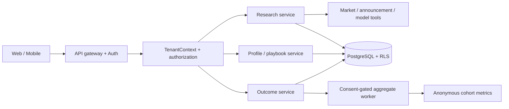

# TradingAgentsChina SaaS Architecture

## Requirements

### Functional

- Isolate every user's profile, research, watchlist, account snapshot, and outcomes by tenant.
- Let users select a playbook, record outcome feedback, and receive personal analytics.
- Aggregate strategy/outcome metrics only for users who separately consent.
- Keep market data and LLM providers pluggable; never let an LLM choose a tenant or bypass risk rules.

### Non-functional targets

- API p95: <500 ms excluding external data/model calls; external work is asynchronous or explicitly loading.
- Availability: 99.9% for the SaaS API after production launch.
- Security: TLS, short-lived authenticated sessions, tenant RLS, audit trail, least-privilege service roles.
- Reliability: daily encrypted backups, RPO ≤24 h for MVP, documented deletion/export workflows.

## Architecture

## Data boundaries

| Data | Scope | Cross-user analytics |
| --- | --- | --- |
| Profile, watchlist, reports | tenant + user | No |
| Account cash and positions | tenant + user, sensitive | Never |
| Strategy outcome (return, days, fit) | tenant + user | Only with active, explicit consent |
| Aggregate cohort metric | anonymized cohort | Only above minimum sample threshold |

## Key decisions and trade-offs

- **Modular monolith first:** keep one deployable service and clear modules; split workers only when data/model latency requires it.
- **PostgreSQL with RLS:** gives transactional relations and database-enforced tenant isolation. Every tenant query must set `app.tenant_id` within the transaction.
- **No pooled user keys:** SaaS uses platform-managed provider credentials or a dedicated secrets manager; client-entered keys remain unavailable to other users and are never included in logs.
- **Outcome analytics not social ranking:** no leaderboards based on private returns; only anonymized product research and a user's own dashboard.

## Failure modes

| Failure | Mitigation |
| --- | --- |
| Missing tenant context | Deny request; do not default to a tenant |
| RLS context absent | Query returns no rows; service alerts |
| Data/model provider timeout | Mark source unavailable; preserve deterministic report and retry asynchronously |
| Consent revoked | Stop future aggregation; remove the user from derived cohorts per retention policy |
| Small/biased outcome sample | Mark exploratory; do not make effectiveness claims |

## Deployment gate

The current local server is not a SaaS deployment. Before opening external access, add managed authentication, HTTPS, rate limiting, CSRF/session protections, secrets manager, database migration runner, RLS integration tests, observability, backups, deletion/export workflows, and a privacy/consent UI.
